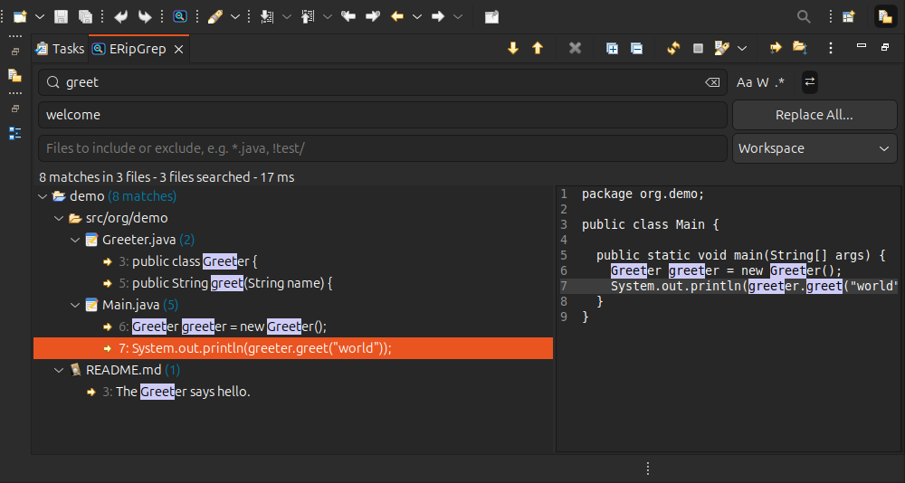

#  ERipGrep : A plugin to search in Eclipse workspace using the amazing [RipGrep](https://github.com/BurntSushi/ripgrep).

[](https://github.com/RoiSoleil/eripgrep/actions/workflows/build.yml)
[](https://codecov.io/gh/RoiSoleil/eripgrep)
[](LICENSE)

To start a search with ERipGrep, select a text in an editor and hit "Ctrl+Alt+Shift+G" and let RipGrep do the magic.
Without a selection, the same shortcut opens the view, ready to type a search.



# Features

- **Search as you type**: the results arrive while RipGrep finds them, with the number of matches, of files and
  the time of the search.
- Case sensitive, whole word and regular expression searches, over several lines too.
- **Replace with a preview**: the matches which are still in the view, or only the selected ones, are replaced
  after a preview of the changes, and the replacement can be undone. RipGrep computes the replacements: a regular
  expression uses `$1` or `$name` for its groups (RipGrep 15 or newer; older versions replace plain text only).
- Filter on the files: `*.java, .xml, !test/` (globs separated by commas, a leading `!` excludes).
- Scope of the search: the workspace, the selected resources or the project of the editor.
- **Preview** of the lines around the selected match, beside or below the results.
- Lines of context around the matches, hidden files, `.gitignore` and other ignore files: in the menu of the view.
- Results by project, optionally grouped by folder and sorted; Up and Down go from match to match and show
  it in its editor, Delete removes the selected results, Ctrl+C copies them.
- History of the searches, kept between the sessions.
- The icon of the view shows a running search (orange dot) and a search finished while you were elsewhere
  (green dot).
- Closed projects are searched too (see the preferences).

RipGrep is found on the `PATH`; its location, the number of threads, the maximum number of matches and additional
arguments of RipGrep are in *Window > Preferences > ERipGrep*.

# Update Site

You can find the latest build of ERipGrep here:

https://github.com/RoiSoleil/eripgrep/raw/update-site/latest/

# Build

Requires JDK 21, Maven 3.9 (the Apache distribution: the Maven packaged by some Linux distributions does not work
with Tycho) and, for the tests, RipGrep on the `PATH`.

```bash
mvn clean install   # update site in update-site/org.eclipse.eripgrep/target/repository
```

The tests of the view run in an Eclipse workbench: a window opens on the current display (use `xvfb-run` on a
server), `-DskipTests` skips them. `GDK_BACKEND=x11 ERIPGREP_SCREENSHOT=$PWD/docs/screenshot.png mvn verify`
saves the picture of the view shown above.

JaCoCo measures the coverage of the plug-in by the tests; `tests/org.eclipse.eripgrep.coverage` writes the report in
`target/site/jacoco-aggregate` and GitHub Actions sends it to [Codecov](https://codecov.io/gh/RoiSoleil/eripgrep).

The icons are drawn by `tools/MakeIcon.java` (same drawing as `icons/eripgrep.svg`):

```bash
java tools/MakeIcon.java eripgrep 16 bundles/org.eclipse.eripgrep/icons/eripgrep.png
```

# License

[Eclipse Public License, v2.0](http://www.eclipse.org/legal/epl-v20.html)
